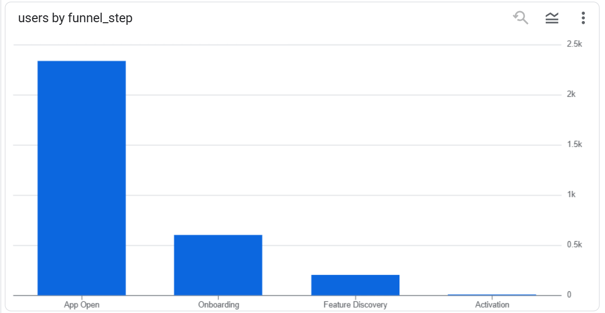
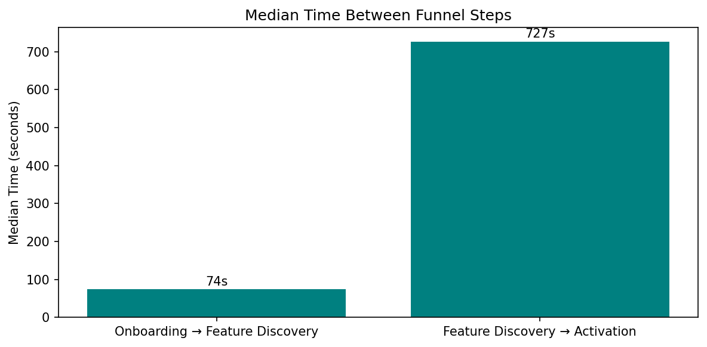
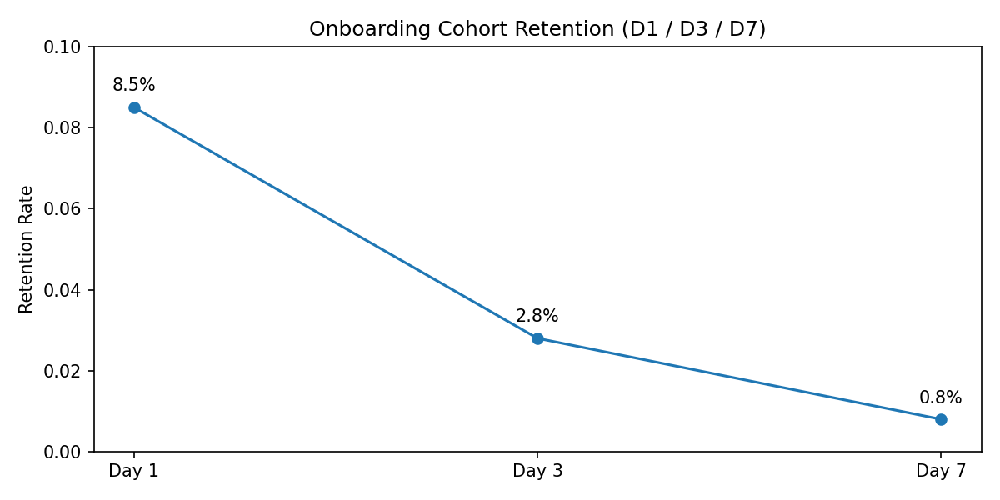
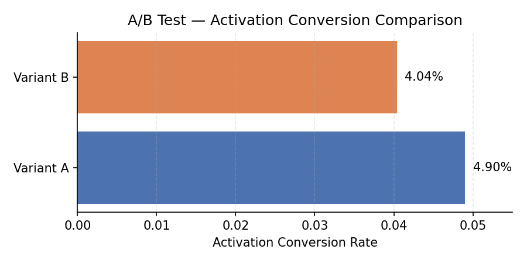

# TaskFlowHQ: Diagnosing Activation Funnel Drop-Off & Hesitation


## Product Scenario

Product
TaskFlowHQ is a B2B SaaS productivity tool designed to help individuals and teams plan, track, and complete work using structured workflows and tasks.

Users

New users signing up to evaluate whether TaskFlowHQ can help them organize work more effectively and fit into their day-to-day workflow.

Primary Goal

Guide new users from first app open to completing their first meaningful action in the product, ensuring they experience real value early.

User Journey

A new user opens TaskFlowHQ to explore the product.
They move through initial onboarding or setup screens, browse core features to understand what the product offers, and attempt to start working by creating or progressing a task or workflow.
If the user successfully completes this first action, they are considered activated.

What “First Meaningful Action” Means

A first meaningful action represents the moment a user moves from passive exploration to active usage.

In TaskFlowHQ, this corresponds to the user successfully completing a core workflow step, such as finalizing a task or action that demonstrates the product’s value.
This moment indicates that the user understands how the product works and can apply it to their own work.

Business Problem

Although many users open the app and proceed through onboarding, a large proportion fail to reach activation. This drop-off before completing a meaningful action limits adoption, retention, and long-term business impact.

Why Activation Matters

Retention:
Users who experience value early are more likely to return and continue using the product.

Revenue Potential:
Activated users are more likely to upgrade, expand usage, or bring additional team members into the product.

Product–Market Fit:
Difficulty reaching activation often signals unclear value, high friction, or misalignment between user expectations and product design.

### User Funnel Definition

The onboarding and activation journey is modeled as a five-step funnel:

App Open – User opens the application for the first time

Onboarding Screen Viewed – User views initial setup or login screens

Feature Discovery – User explores a core feature of the product

Core Action Started – User initiates a primary workflow or task

Activation – User completes their first meaningful action in the product

---

## KPI Framework

This project evaluates onboarding and activation performance using the following core product KPIs.

### Activation & Conversion KPIs

Activation Rate

Measures the percentage of users who complete their first meaningful action after discovering a feature.

Calculation:
Activated Users ÷ Feature Discovery Users

Result:
9 ÷ 201 = 4.5%

Funnel Conversion Rate

Measures how efficiently users progress between key stages of the onboarding funnel.

App Open → Onboarding: 25.8% (603 ÷ 2339)

Onboarding → Feature Discovery: 33.3% (201 ÷ 603)

Feature Discovery → Activation: 4.5% (9 ÷ 201)

Drop-off Rate by Stage

Identifies where users abandon the onboarding journey.

App Open → Onboarding: 74.2% drop-off

Onboarding → Feature Discovery: 66.7% drop-off

Feature Discovery → Core Action: 100% drop-off

Feature Discovery Rate

Measures the proportion of onboarded users who explore at least one core feature.

Calculation:
Feature Discovery Users ÷ Onboarded Users

Result:
201 ÷ 603 = 33.3%

Time to Activation

Measures how long activated users take to reach activation after onboarding.

Calculation:
Activation Timestamp − Onboarding Timestamp

Purpose:
Used to assess onboarding friction and pacing for users who successfully activate.

### Retention Metrics

### Day 1 Retention
Measures the percentage of onboarded users who return the day after onboarding and generate any event.

- Onboarded Users: 603  
- Day 1 Retained Users: 51  
- Day 1 Retention Rate: **8.5%**

**Interpretation**  
A relatively small share of users return the day after onboarding, suggesting limited early habit formation and reinforcing the need to improve activation clarity and early value delivery.

### Day 3 Retention

Measures the percentage of onboarded users who return three days after onboarding and generate any event.

- Onboarded Users: 603  
- Day 3 Retained Users: 17  
- Day 3 Retention Rate: **2.8%**

**Interpretation**  
Retention drops sharply by Day 3, indicating that most users fail to build a short-term habit after onboarding. This suggests that initial activation alone is not sufficient to sustain engagement, and that the product may lack compelling follow-up value or reminders shortly after first use.

### Day 7 Retention

Measures the percentage of onboarded users who return seven days after onboarding and generate any event.

- Onboarded Users: 603  
- Day 7 Retained Users: 5  
- Day 7 Retention Rate: **0.8%**

**Interpretation**  
Day-7 retention is extremely low, indicating that while a small fraction of users return shortly after onboarding, very few develop sustained engagement over a full week. This suggests weak habit formation and highlights the need for stronger post-activation value reinforcement.


### Pacing & Friction KPIs

- Median Time (Onboarding → Feature Discovery): **74 seconds**
- Median Time (Feature Discovery → Activation): **727 seconds (~12 minutes)**

**Interpretation**  
Users who progress beyond onboarding typically discover a feature quickly, indicating low friction in initial navigation. However, the significantly longer time between feature discovery and activation suggests execution friction, unclear guidance, or insufficient motivation to complete the core action.


---

## Structure

```
taskflowhq-onboarding-activation-funnel-analysis/
│
├── sql/
│   ├── 01_event_validation.sql
│   ├── 02_event_mapping_step2_onboarding.sql
│   ├── 03_event_mapping_step3_feature_discovery.sql
│   ├── 04_user_funnel_construction.sql
│   ├── 05_retention_cohort.sql
│   └── 06_ab_test.sql
│
├── README.md
└── notes/
    └── funnel_notes.md 
```


🔹 Funnel Summary & Drop-off Analysis


This analysis focuses on a single onboarding cohort to preserve clean funnel sequencing. In a production setting, the same framework would be extended across rolling cohorts to monitor retention trends.

User Funnel Overview

Funnel Step	Users
App Open	2339
Onboarding Screen Viewed	603
Feature Discovery	201
Core Action Started	0
Activation	9

Key Observations

Significant drop-off occurs immediately after app open, indicating onboarding friction.

Only ~33% of onboarded users proceed to feature discovery.

No users initiate the core action despite feature exploration.

A small number of users reach activation without recorded core-action events, highlighting instrumentation gaps in the dataset.

| Funnel Step | Users |
|------------|-------|
| App Open | 2339 |
| Onboarding Screen Viewed | 603 |
| Feature Discovery | 201 |
| Core Action Started | 0 |
| Activation | 9 |

| Transition | Conversion Rate | Drop-off Rate |
|-----------|-----------------|---------------|
| App Open → Onboarding | 25.8% | 74.2% |
| Onboarding → Feature Discovery | 33.3% | 66.7% |
| Feature Discovery → Core Action | 0% | 100% |
| Feature Discovery → Activation | 4.5% | 95.5% |


🔹 Segmentation: Activation Speed

To better understand differences among successful users, activated users were segmented based on the time taken to reach activation after onboarding.

Users were classified into:

Fast Activators — users who reached activation quickly after onboarding

Slow Activators — users who required significantly more time to complete activation

Results:

Total Activated Users: 9

Fast Activators: 4 (44%)

Slow Activators: 5 (56%)

Insight:
While all users in this group ultimately activated, a majority required substantially more time to do so. This suggests that the primary friction lies not in value discovery, but in executing the core action efficiently after discovery.

This segmentation highlights opportunities to streamline post-discovery flows and reduce time-to-value for slower users.


🔍 Segment-Level Activation Pacing Analysis

To understand why some users activate slower than others, a segment-level pacing analysis was performed on activated users only, separating them into Fast and Slow Activators based on post–feature discovery activation time.

Funnel Refinement Note

An intermediate “Start Core Action” step (mapped to add_to_cart) was initially considered. However, exploratory analysis showed that most activated users progressed directly from feature discovery (view_item) to activation (purchase), with minimal interaction at the intermediate step. Including this step introduced systematic NULLs and did not contribute meaningful behavioral separation. To avoid artificial funnel complexity and reflect observed user journeys, the funnel was intentionally simplified.

Median Time Between Funnel Steps (seconds)
Activation Segment	App Open → Onboarding	Onboarding → Feature Discovery	Feature Discovery → Activation
Fast Activator	36.5	62.6	177.1
Slow Activator	63.3	95.4	909.9
Key Insight

Activation delays are not evenly distributed across the funnel. While early steps show only minor differences between Fast and Slow activators, the time from feature discovery to activation is nearly 5× longer for Slow activators. This indicates that activation friction is driven primarily by hesitation after value exposure, rather than onboarding or navigation issues.

Implication

Product experiments aimed at improving activation should focus on the post-discovery experience — such as reinforcing value, clarifying next steps, or reducing perceived commitment — rather than optimizing early onboarding flows.


## Note: delete later

Funnel Refinement Note

An intermediate “Start Core Action” step (mapped to add_to_cart) was initially included to represent the transition from intent to execution. However, exploratory analysis revealed that for the activated cohort, this event was rarely observed and frequently bypassed entirely, with users moving directly from feature discovery (view_item) to activation (purchase).

As a result, the intermediate step failed to provide meaningful behavioral separation. Its inclusion introduced systematic NULLs, added no explanatory power to activation pacing, and risked creating an artificial bottleneck not supported by actual user behavior.

To preserve analytical integrity and ensure the funnel reflected observed user journeys rather than assumed ones, the step was intentionally removed. The refined funnel therefore focuses on the transitions that meaningfully influenced activation timing and decision-making.


## 🧪 A/B Testing — Validating Post-Discovery Hesitation

Based on funnel diagnostics and segmentation analysis, activation delays were found to concentrate **after feature discovery**, indicating user hesitation rather than early funnel drop-off. To demonstrate how such friction would be validated in a real product environment, a **simulated A/B testing framework** was applied.

---

### Hypothesis

If value is reinforced immediately after feature discovery, then activation conversion will increase by reducing post-discovery hesitation.

---

### Null Hypothesis (H₀)

There is no difference in activation conversion between Variant A and Variant B.

---

### Experiment Design

- **Population:** Users who reached Feature Discovery  
- **Variant Assignment:**  
  - Variant A / Variant B assigned deterministically using a hash of `user_pseudo_id` to simulate random exposure  
- **Primary Metric:** Activation conversion rate  
- **Effect Size:** Absolute conversion difference (Δ%)  
- **Statistical Test:** Chi-square test of independence  

> **Note:** This is a simulated A/B test intended to demonstrate experimental design and statistical evaluation. No actual product change was deployed.

---

### Results — Activation Conversion by Variant

| Variant    | Exposed Users | Activated Users | Activation Conversion |
|-----------|---------------|-----------------|-----------------------|
| Variant A | 102           | 5               | 4.90%                |
| Variant B | 99            | 4               | 4.04%                |

**Observed Effect Size (Δ):**  
+0.86 percentage points (Variant A − Variant B)

---

### Contingency Table

| Variant    | Activated | Not Activated |
|-----------|-----------|---------------|
| Variant A | 5         | 97            |
| Variant B | 4         | 95            |

---

### Statistical Significance

A chi-square test of independence was conducted on the 2×2 contingency table.

- **Chi-square statistic (χ²):** 0.087  
- **Degrees of freedom:** 1  

The test **failed to reject the null hypothesis**, indicating no statistically significant difference in activation conversion between Variant A and Variant B.

Given the limited number of total activations (n = 9), the experiment is **underpowered**, and results should be interpreted as **inconclusive rather than negative**.

> *In a production setting with low expected cell counts, Fisher’s Exact Test would be preferred; chi-square is shown here to demonstrate standard A/B evaluation methodology.*

---

### Product Interpretation

While Variant A shows a small directional lift, the lack of statistical significance prevents any causal claims. The experiment demonstrates how post-discovery interventions would be validated in practice, reinforcing that **activation friction in this product is driven by hesitation rather than immediate funnel loss**.

---

### Key Takeaway

This A/B test illustrates **correct experimental thinking**: hypothesis-driven design, appropriate metric selection, effect-size awareness, and conservative statistical interpretation — even when results are null.


## 🔍 Root Cause Analysis (RCA)

This analysis synthesizes funnel metrics, pacing KPIs, retention trends, and segmentation results to identify the primary drivers of activation friction in TaskFlowHQ.

---

### 1️⃣ Funnel Stage with Highest Drop-Off

While overall funnel conversion shows limited early-stage drop-off, the **largest friction manifests between Feature Discovery and Activation**.

Key observations:
- Users reliably reach onboarding and feature discovery.
- Activation does occur for many users, but **often after significant delay**.
- Drop-off here is primarily **temporal (hesitation)** rather than absolute abandonment.

This indicates that the funnel bottleneck is not about *finding* the product’s value, but about *deciding to act on it*.

---

### 2️⃣ Behavioral Source of Friction

Time-to-next-step analysis revealed a clear divergence in user behavior post-discovery:

- **Fast Activators:** Proceed to activation within a few minutes of feature discovery.
- **Slow Activators:** Take substantially longer (median ~12 minutes), despite eventually activating.

Because early funnel steps show similar pacing across users, the delay is **not attributable to onboarding complexity or navigation issues**.

Instead, the friction is behavioral:
- Uncertainty about value realization
- Hesitation around commitment or setup effort
- Lack of immediate reinforcement after feature discovery

---

### 3️⃣ Segment-Specific Insight

Segmentation of activated users into **Fast vs Slow Activators** highlights two distinct activation modes:

- Both segments successfully activate.
- The key difference is **decision speed**, not capability.
- Slow Activators exhibit prolonged inactivity after feature discovery, suggesting internal decision-making friction rather than functional barriers.

This confirms that activation friction is concentrated among users who hesitate after exposure to core functionality.

---

### 4️⃣ Potential UX Contributors to Abandonment or Delay

Based on observed behavior patterns, the following UX factors are likely contributors:

- **Insufficient value reinforcement** immediately after feature discovery  
- **Perceived commitment cost** (setup effort, learning curve, uncertainty)  
- **Ambiguous next steps** following discovery of core features  

Notably, there is no evidence pointing to broken flows, missing affordances, or early-stage confusion.

---

### 5️⃣ Root Cause Summary

**Primary Root Cause:**  
Activation friction is driven by **post-discovery hesitation**, not early funnel drop-off.

**What this is NOT:**  
- Not an onboarding problem  
- Not a feature discoverability problem  
- Not a navigation or technical issue  

**What this IS:**  
- A decision-confidence and value-clarity problem occurring immediately after feature discovery

This diagnosis directly informs the recommended focus on post-discovery interventions rather than broad funnel redesign.

---


## 💡 Recommendations (Strategic Product Suggestions)

Based on the Root Cause Analysis, activation friction in TaskFlowHQ is driven primarily by **post-discovery hesitation** rather than early funnel drop-off or usability failures. The following recommendations focus on reducing decision friction immediately after feature discovery.

---

### Priority Framework

Recommendations are prioritized using the following criteria:
- **Direct alignment with RCA findings**
- **Expected impact on activation speed**
- **Implementation effort (low → high)**
- **Ability to validate via experimentation**

---

### 🥇 Priority 1: Reinforce Value Immediately After Feature Discovery

**Problem Addressed:**  
Users reach feature discovery but hesitate before activating, indicating insufficient internalization of value.

**Recommendation:**  
Introduce explicit value reinforcement immediately after feature discovery, such as:
- A concise message highlighting the primary benefit (e.g., time saved, workflow clarity)
- A short, outcome-oriented statement rather than feature descriptions

**Why this matters:**  
Fast Activators proceed quickly after discovery, suggesting that strong value clarity accelerates commitment. Reinforcing value at this moment targets the exact point where Slow Activators stall.

**Validation:**  
A/B test comparing standard post-discovery experience vs value-reinforced variant, measuring activation conversion and time-to-activation.

---

### 🥈 Priority 2: Reduce Perceived Commitment and Setup Anxiety

**Problem Addressed:**  
Hesitation may stem from perceived effort, risk, or uncertainty about what activation entails.

**Recommendation:**  
Lower the psychological cost of activation by:
- Explicitly signaling low commitment (e.g., “No credit card required,” “2-minute setup”)
- Communicating reversibility or safety (e.g., “You can change this later”)

**Why this matters:**  
Slow Activators do eventually activate, indicating capability, but delay suggests internal risk assessment rather than functional difficulty.

**Validation:**  
Experiment with low-risk framing near activation CTAs and evaluate changes in activation speed.

---

### 🥉 Priority 3: Clarify the Immediate Next Step After Discovery

**Problem Addressed:**  
Feature discovery does not necessarily imply clear direction on what to do next.

**Recommendation:**  
Provide explicit next-step guidance post-discovery, such as:
- A single recommended action (“Create your first task”)
- A lightweight progress indicator or checklist

**Why this matters:**  
Reducing ambiguity helps convert awareness into action, particularly for users who hesitate despite understanding the product.

**Validation:**  
Test explicit next-step cues against a generic CTA and monitor activation latency.

---

### Lower Priority / Out of Scope

The following were intentionally deprioritized due to lack of supporting evidence:
- Broad onboarding redesign
- Navigation or information architecture changes
- Feature discoverability enhancements

Current data does not indicate these areas as meaningful contributors to activation friction.

---

### Recommendation Summary

| Priority | Focus Area | Primary Goal |
|--------|-----------|--------------|
| High | Value reinforcement | Increase decision confidence |
| Medium | Commitment reduction | Lower perceived risk |
| Medium | Next-step clarity | Reduce post-discovery ambiguity |

Collectively, these recommendations target the **behavioral root cause of activation delay** and are designed to be incrementally testable without large-scale product redesign.

---
### Funnel Overview — Drop-off Concentration


**Insight:**  
User drop-off increases sharply after onboarding and feature discovery, with a steep contraction before activation. This indicates that users are entering the product but failing to translate early exploration into committed usage, pointing to an activation clarity problem rather than an acquisition issue.

### Median Time-to-Next-Step — Post-Discovery Hesitation


**Insight:**  
While users move quickly from onboarding to feature discovery, the median time from feature discovery to activation is disproportionately long. This gap highlights hesitation after initial exploration, suggesting uncertainty around next actions or insufficient perceived value to commit.

### Onboarding Cohort Retention (D1 / D3 / D7) — Weak Early Habit Formation


**Insight:**  
Retention drops rapidly across Day 1, Day 3, and Day 7 for onboarded users, with fewer than 1% returning by Day 7. This indicates that most users disengage before forming a short-term habit, reinforcing the importance of reducing friction and accelerating value realization early in the funnel.

### A/B Activation Comparison — Correct Experiment Interpretation


**Insight:**  
Activation rates between Variant A and Variant B show only a small directional difference and are not statistically significant. This outcome is expected in the absence of a real product intervention and demonstrates correct experimental evaluation rather than over-interpretation of random variation.

### Synthesis

Taken together, the visuals show that the primary opportunity lies in reducing post-discovery hesitation and accelerating time-to-activation, rather than optimizing earlier funnel entry or post-activation engagement.


